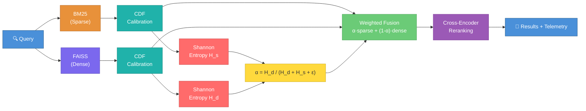

# 🔬 Calibrated Entropy-Weighted Hybrid Retrieval

[](https://github.com/ayushmath07/Semantic-Document-Retrieval-API/actions/workflows/ci.yml)
[](https://www.python.org/downloads/release/python-3110/)
[](https://fastapi.tiangolo.com/)
[](LICENSE)
[](https://github.com/astral-sh/ruff)

A research-oriented hybrid retrieval system that tests whether **score calibration makes retrieval uncertainty measurable and useful**. Combines BM25 sparse retrieval, FAISS dense retrieval, corpus-level CDF score calibration, entropy-weighted adaptive fusion, and cross-encoder reranking — all behind a FastAPI service.

> **Benchmark:** [BEIR SciFact](https://github.com/beir-cellar/beir) — 5,183 PubMed abstracts, 300 test claims, document-level qrels.

---

## ✨ Highlights

- **7 retrieval modes** for systematic ablation — from single-retriever baselines to full calibrated reranking
- **Corpus-level CDF calibration** maps BM25 and dense scores to a common probability space, making entropy comparable across retrievers
- **Entropy-weighted adaptive fusion** dynamically adjusts BM25↔dense balance per query based on each retriever's confidence
- **Statistical rigor** — paired bootstrap significance tests (1,000 resamples) and Pearson correlations with p-values
- **Production-ready API** with FastAPI, Docker, CI/CD, and Swagger docs

---

## 🏗️ Architecture



**Pipeline:** Query → parallel BM25 + FAISS retrieval → CDF calibration to corpus percentiles → Shannon entropy per retriever → adaptive α weighting → score fusion → cross-encoder reranking → ranked results with full telemetry.

---

## 🧪 Research Question

> Does calibrating BM25 and dense retrieval scores to a common probability space via corpus-level CDF normalization make entropy a more reliable predictor of per-query retrieval quality, and does that translate to better fusion?

### Hypotheses

| ID | Hypothesis | Result |
|---|---|---|
| **H1** | CDF entropy has the strongest negative correlation with retrieval quality | ❌ **Not supported** — z-score entropy is the strongest predictor |
| **H2** | Entropy fusion outperforms RRF and fixed-alpha baselines | ⚠️ **Partially supported** — beats fixed-alpha significantly, ties with RRF |

<details>
<summary><b>📐 Method Details</b></summary>

### Corpus-Level CDFs

Built offline during indexing — **not** per-query top-k (which would normalize away the distributional signal):

```
50 SciFact test claims + 50 pseudo-queries from corpus chunks
        │
        ▼
score every query against all 17,243 chunks
        │
        ▼
sort 1,724,300 BM25 scores and 1,724,300 dense scores
        │
        ▼
corpus_cdf_bm25.npy and corpus_cdf_dense.npy
```

### Score Calibration

```
calibrated_score = CDF_corpus(raw_score)    # maps to corpus percentile
```

### Entropy Computation

```
H = −Σᵢ pᵢ log₂(pᵢ)
```

### Adaptive Fusion

```
α = H_dense / (H_dense + H_sparse + ε)
fused = α · sparse_score + (1 − α) · dense_score
```

When dense retrieval has high entropy (low confidence), α increases → system trusts BM25 more. When sparse retrieval has high entropy, α decreases → system trusts dense retrieval more.

### Bug Fixes from Initial Run

The first toy-corpus run exposed two evaluation bugs that were fixed before SciFact benchmarking:

- **Entropy invariance bug:** Entropy was subtracting the minimum score before normalization, causing raw/min-max/z-score entropy to collapse under affine transforms. Fixed: nonnegative calibrated scores are treated as probability mass directly; softmax is used only for negative-valued z-scores.
- **Chunk-level evaluation:** Metrics were computed at chunk-level, but BEIR qrels are document-level. Fixed: retrieved chunks are deduplicated by source document ID before metric computation.

</details>

---

## 📊 Benchmark Results (BEIR SciFact)

```bash
python scripts/build_index.py --dataset scifact
python scripts/evaluate.py
```

### Retrieval Ablation

| Mode | NDCG@10 | MRR | P@3 | P@5 | R@5 | p95 Latency |
|:---|---:|---:|---:|---:|---:|---:|
| `dense` | 0.6715 | 0.6329 | 0.2466 | 0.1647 | 0.7495 | 33 ms |
| `sparse` | 0.6151 | 0.5804 | 0.2233 | 0.1520 | 0.7089 | 130 ms |
| `rrf` | 0.7028 | 0.6713 | 0.2555 | 0.1680 | 0.7744 | 249 ms |
| `hybrid_fixed` | 0.6829 | 0.6527 | 0.2522 | 0.1647 | 0.7594 | 232 ms |
| `hybrid_calibrated` | 0.6981 | 0.6672 | 0.2489 | 0.1660 | 0.7661 | 241 ms |
| `hybrid_fixed_rerank` | 0.7006 | 0.6653 | 0.2578 | 0.1700 | 0.7714 | 2432 ms |
| **`hybrid_calibrated_rerank`** | **0.7071** | **0.6719** | **0.2622** | **0.1720** | **0.7838** | 2116 ms |

> **Best overall:** `hybrid_calibrated_rerank` achieves the highest NDCG@10 (0.7071) with the lowest per-query variance (σ = 0.3703).

<details>
<summary><b>📈 H1: Entropy Correlation Analysis</b></summary>

Pearson correlations — entropy as predictor vs. per-query retrieval quality. Stronger negative r = higher entropy better predicts lower quality.

| Retriever | Calibration | r vs NDCG@10 | p-value | r vs MRR | p-value |
|:---|:---|---:|---:|---:|---:|
| Sparse | raw | 0.0033 | 0.9550 | 0.0057 | 0.9220 |
| Sparse | min-max | 0.0033 | 0.9550 | 0.0057 | 0.9220 |
| Sparse | z-score | **−0.3759** | <0.000001 | **−0.3855** | <0.000001 |
| Sparse | CDF | −0.0085 | 0.8834 | −0.0031 | 0.9575 |
| Dense | raw | 0.0865 | 0.1348 | 0.0636 | 0.2718 |
| Dense | min-max | 0.0053 | 0.9273 | −0.0164 | 0.7775 |
| Dense | z-score | **−0.4065** | <0.000001 | **−0.3970** | <0.000001 |
| Dense | CDF | −0.1151 | 0.0463 | −0.1100 | 0.0571 |

**Verdict:** H1 is **not supported** as originally stated. Z-score entropy is the strongest negative predictor for both retrievers on SciFact. CDF entropy shows a weak but significant correlation for dense retrieval only.

</details>

<details>
<summary><b>📉 H2: Paired Bootstrap Significance Tests</b></summary>

1,000 paired bootstrap resamples over 300 SciFact test queries.

| Comparison | Metric | Mean Δ | 95% CI | p-value | Significant? |
|:---|:---|---:|:---|---:|:---|
| `calibrated` vs `rrf` | NDCG@10 | −0.0047 | [−0.017, +0.007] | 0.426 | No |
| `calibrated` vs `rrf` | P@3 | −0.0067 | [−0.012, −0.002] | 0.002 | Yes, worse |
| `calibrated` vs `fixed` | NDCG@10 | **+0.0152** | [+0.003, +0.027] | **0.012** | ✅ Yes |
| `calibrated` vs `fixed` | MRR | **+0.0145** | [+0.002, +0.027] | **0.028** | ✅ Yes |
| `cal_rerank` vs `fix_rerank` | NDCG@10 | +0.0065 | [−0.006, +0.020] | 0.314 | No |

**Verdict:** H2 is **partially supported**. CDF entropy fusion significantly outperforms fixed-alpha fusion (p=0.012 on NDCG@10). It does not beat RRF, and with reranking the improvement is not statistically significant.

</details>

---

## 🎛️ Retrieval Modes

| Mode | Strategy | Description |
|:---|:---|:---|
| `dense` | Single | FAISS dense retrieval only |
| `sparse` | Single | BM25 lexical retrieval only |
| `rrf` | Fusion | Reciprocal Rank Fusion (k=60) |
| `hybrid_fixed` | Fusion | Min-max calibration + fixed α=0.5 |
| `hybrid_calibrated` | Fusion | CDF calibration + entropy-weighted α |
| `hybrid_fixed_rerank` | Fusion + Rerank | Fixed hybrid → cross-encoder |
| `hybrid_calibrated_rerank` | Full Pipeline | CDF entropy hybrid → cross-encoder |

---

## 🚀 Quick Start

```bash
# 1. Clone and set up
git clone https://github.com/ayushmath07/Semantic-Document-Retrieval-API.git
cd Semantic-Document-Retrieval-API

python -m venv venv
venv\Scripts\activate          # Windows
# source venv/bin/activate     # macOS/Linux
pip install -r requirements.txt

# 2. Build the index (downloads SciFact on first run)
python scripts/build_index.py --dataset scifact

# 3. Start the API
uvicorn app.main:app --reload
```

Open **[http://127.0.0.1:8000/docs](http://127.0.0.1:8000/docs)** for interactive Swagger docs.

> **Note:** First run downloads SentenceTransformers models (~90 MB). Dense retrieval uses `all-MiniLM-L6-v2`; reranking uses `cross-encoder/ms-marco-MiniLM-L6-v2`.

---

## 📡 API Reference

### `GET /modes` — List retrieval modes

```bash
curl http://127.0.0.1:8000/modes
```

### `POST /query` — Search documents

```bash
curl -X POST http://127.0.0.1:8000/query \
  -H "Content-Type: application/json" \
  -d '{"question": "0-dimensional biomaterials show inductive properties.", "top_k": 3, "mode": "hybrid_calibrated_rerank"}'
```

<details>
<summary>Example response</summary>

```json
{
  "question": "0-dimensional biomaterials show inductive properties.",
  "answer": "[4983046] Biomaterial dimensionality ...",
  "sources": [
    {
      "source": "4983046",
      "chunk": 1,
      "text": "...",
      "score": 0.823,
      "cross_encoder_score": 2.41
    }
  ],
  "retrieval_latency_ms": 241.5,
  "telemetry": {
    "mode": "hybrid_calibrated_rerank",
    "alpha": 0.487,
    "h_sparse": 8.21,
    "h_dense": 7.79,
    "calibration": "cdf",
    "reranked": true
  }
}
```

</details>

### `POST /upload` — Upload documents

```bash
curl -X POST http://127.0.0.1:8000/upload \
  -F "file=@paper.pdf"
```

Supports `.pdf`, `.txt`, and `.md` files.

### `GET /health` — Health check

### `GET /documents` — List indexed documents

---

## 📁 Project Structure

```
app/
├── main.py               FastAPI application and route handlers
├── retriever.py           Seven-mode retrieval orchestrator
├── calibration.py         CDF transforms, entropy, QPP predictors, statistics
├── fusion.py              RRF, fixed linear fusion, entropy-weighted fusion
├── reranker.py            Cross-encoder reranking (ms-marco-MiniLM-L6-v2)
├── sparse_retriever.py    BM25 index, search, and full-corpus scoring
└── datasets.py            SciFact corpus/query/qrels loaders

scripts/
├── build_index.py         Builds FAISS, BM25, CDFs, corpus LM, doc lookup
└── evaluate.py            Runs H1/H2 evaluation and bootstrap significance tests

tests/                     pytest test suite (9 tests)
eval/                      Golden set labels and generated results
data/faiss_index/          Runtime artifacts (FAISS, BM25, CDFs, metadata)
```

<details>
<summary><b>Runtime artifacts</b></summary>

| Artifact | Purpose |
|:---|:---|
| `index.faiss`, `index.pkl` | Dense FAISS vector store |
| `bm25_index.pkl` | Tokenized BM25 corpus and metadata |
| `corpus_cdf_bm25.npy` | Corpus-level BM25 score CDF |
| `corpus_cdf_dense.npy` | Corpus-level dense score CDF |
| `corpus_lm.pkl` | Corpus unigram language model (Clarity Score) |
| `doc_lookup.pkl` | (source, chunk) → text lookup |
| `index_metadata.json` | Dataset and artifact build metadata |

</details>

---

## ⚙️ Configuration

| Variable | Default | Description |
|:---|:---|:---|
| `EMBEDDING_MODEL` | `sentence-transformers/all-MiniLM-L6-v2` | HuggingFace embedding model |
| `DATA_DIR` | `data` | Base directory for uploads and index |
| `MIN_RELEVANCE_SCORE` | `0.0` | Minimum similarity threshold (dense-only mode) |
| `CANDIDATE_K` | `20` | Candidates per retriever before fusion |

Copy `.env.example` to `.env` to customize:

```bash
cp .env.example .env
```

---

## 🐳 Docker

```bash
docker compose up --build
```

API docs at **[http://127.0.0.1:8000/docs](http://127.0.0.1:8000/docs)**.

---

## 🧪 Testing

```bash
pytest tests/ -v
```

9 tests covering: health checks, upload validation, empty-index behavior, mode listing, mode validation, query telemetry, calibration entropy behavior, and document listing.

---

## 🔬 Run Full Evaluation

```bash
python scripts/build_index.py --dataset scifact
python scripts/evaluate.py
```

The evaluator outputs:
- Aggregate metrics for all 7 modes
- NDCG@10 variance and per-query metrics
- H1 Pearson correlations with p-values
- H2 paired bootstrap confidence intervals and p-values
- Per-query rankings, relevance flags, and telemetry

Full results are saved to `eval/results.json`.

---

## 💡 Interpretation

The original toy CS corpus was useful for plumbing, but it was too easy and too small to validate the research claim. SciFact changes the story: **calibration is not a universal win**, RRF remains a strong baseline, and the clearest uncertainty signal comes from z-score entropy rather than CDF entropy. That is a stronger project outcome than a polished toy result because the system now produces **falsifiable, benchmarked evidence**.

---

## 🤝 Contributing

See [CONTRIBUTING.md](CONTRIBUTING.md) for setup instructions, code style, and PR guidelines.

## 📄 License

[MIT](LICENSE)
